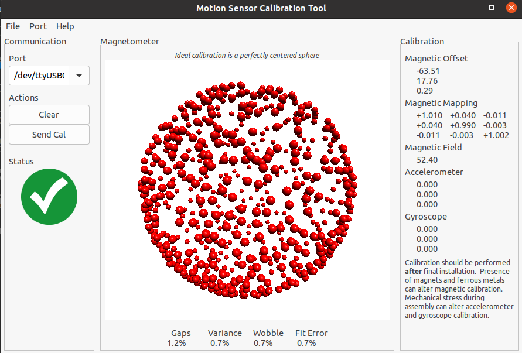

# MotionCal

This is a fork of [PaulStoffregen's MotionCal](https://github.com/PaulStoffregen/MotionCal) with fixes to compile on Ubuntu 20.04. 

## :warning: Important Note

For stability reasons, the baudrate was set to 57600. Make sure the sensor-board uses the same speed.

## Prerequisites

Have a build-system available: 

```
sudo apt install build-essential
```

Check what the latest wxWidgets are:

```
sudo apt-cache search libwxgt*
```

Install them:

```
sudo apt install libwxgtk3.0-gtk3-dev libwxgtk-media3.0-gtk3-dev
```

Install OpenGL-Libaries: 

```
sudo apt-get install xorg-dev libglu1-mesa-dev freeglut3-dev
```

## Build

Just type `make`:

```
$ make
g++ -O2 -Wall -DLINUX `/usr/bin/wx-config --cppflags`   -c -o gui.o gui.cpp
g++ -O2 -Wall -DLINUX `/usr/bin/wx-config --cppflags`   -c -o portlist.o portlist.cpp
perl png2c.pl checkgreen.png checkempty.png checkemptygray.png > images.cpp
gcc -O2 -Wall -DLINUX   -c -o visualize.o visualize.c
gcc -O2 -Wall -DLINUX   -c -o serialdata.o serialdata.c
gcc -O2 -Wall -DLINUX   -c -o rawdata.o rawdata.c
gcc -O2 -Wall -DLINUX   -c -o magcal.o magcal.c
gcc -O2 -Wall -DLINUX   -c -o matrix.o matrix.c
gcc -O2 -Wall -DLINUX   -c -o fusion.o fusion.c
gcc -O2 -Wall -DLINUX   -c -o quality.o quality.c
gcc -O2 -Wall -DLINUX   -c -o mahony.o mahony.c
gcc -O2 -Wall -DLINUX   -c -o imuread.o imuread.c
g++ -O2 -Wall -DLINUX `/usr/bin/wx-config --cppflags`   -c -o images.o images.cpp
gcc -s -O2 -Wall -DLINUX  -o imuread imuread.o visualize.o serialdata.o rawdata.o magcal.o matrix.o fusion.o quality.o mahony.o -lglut -lGLU -lGL -lm
g++ -s -O2 -Wall -DLINUX  -o MotionCal gui.o portlist.o images.o visualize.o serialdata.o rawdata.o magcal.o matrix.o fusion.o quality.o mahony.o -lglut -lGLU -lGL -lm `/usr/bin/wx-config --libs all,opengl`
```

run the application:

```
./MotionCal
```




## References

- [wxWiki - Installing and configuring under Ubuntu](https://wiki.wxwidgets.org/Installing_and_configuring_under_Ubuntu)
- [Compilation problems on ubuntu 18](https://github.com/PaulStoffregen/MotionCal/issues/10)